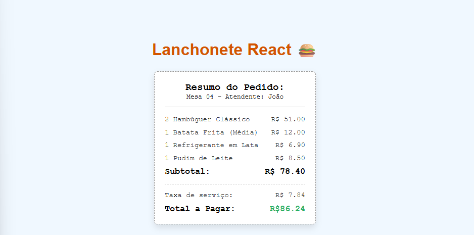

# Lanchonete React 🍔



Uma aplicação React simples para gerar resumos de pedidos em uma lanchonete. Esta aplicação calcula automaticamente o subtotal, taxa de serviço e o total a pagar com base nos itens pedidos.

## Funcionalidades

- **Lista de Pedidos**: Exibe os itens pedidos com quantidade, nome e preço unitário.
- **Cálculo Automático**: Calcula o subtotal, taxa de serviço (10%) e o total final.
- **Interface Simples**: Design limpo e responsivo para visualização rápida do pedido.
- **Dados de Exemplo**: Inclui dados de exemplo para demonstração (Mesa 04, Atendente: João).

## Tecnologias Utilizadas

- **React**: Biblioteca JavaScript para construção de interfaces de usuário.
- **Vite**: Ferramenta de build rápida para desenvolvimento moderno.
- **CSS Modules**: Para estilização modular e isolada dos componentes.
- **ESLint**: Para linting e manutenção da qualidade do código.

## Instalação

1. Clone o repositório ou baixe os arquivos.
2. Navegue até a pasta do projeto:
   ```
   cd aula9
   ```
3. Instale as dependências:
   ```
   npm install
   ```

## Como Usar

1. Inicie o servidor de desenvolvimento:
   ```
   npm run dev
   ```
2. Abra o navegador e acesse `http://localhost:5173` (ou a porta indicada no terminal).

A aplicação será carregada com um pedido de exemplo. Você pode modificar os dados no arquivo `src/App.jsx` para testar com diferentes itens.

## Estrutura do Projeto

```
src/
├── App.jsx              # Componente principal da aplicação
├── App.module.css       # Estilos do App
├── index.css            # Estilos globais
├── main.jsx             # Ponto de entrada da aplicação
├── assets/              # Imagens e recursos estáticos
│   ├── tela.png         # Captura de tela da aplicação
│   └── ...
└── components/
    ├── Comanda.jsx      # Componente para exibir o resumo do pedido
    └── Comanda.module.css # Estilos do componente Comanda
```


## Scripts Disponíveis

- `npm run dev`: Inicia o servidor de desenvolvimento.
- `npm run build`: Constrói a aplicação para produção.
- `npm run lint`: Executa o linter para verificar erros de código.
- `npm run preview`: Visualiza a build de produção localmente.

## Contribuição

Sinta-se à vontade para contribuir com melhorias, correções de bugs ou novas funcionalidades. Abra uma issue ou envie um pull request.

## Licença

Este projeto é de uso educacional e não possui licença específica.
